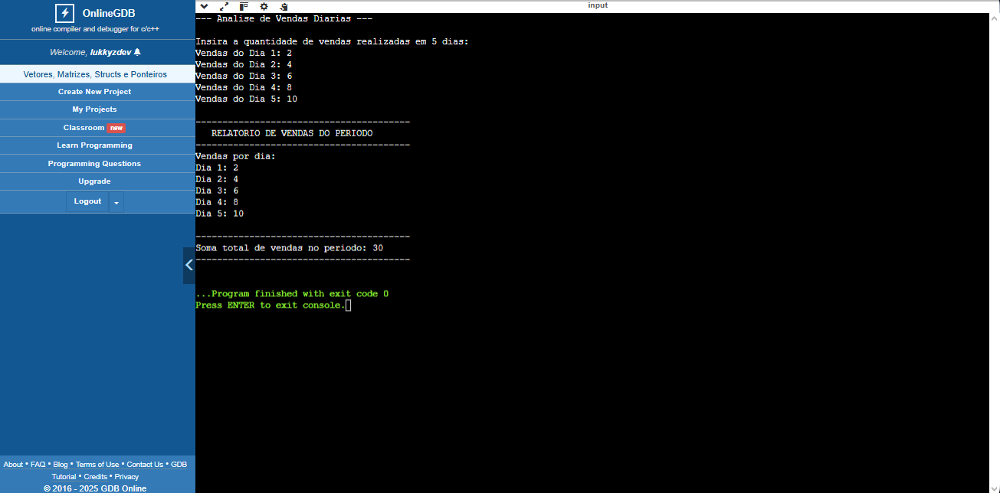

# Declarar e Manipular um Vetor de Inteiros 

## *Atividade Proposta* 📝
*Nesta atividade, o aluno deverá desenvolver
um programa em C que declare e manipule um vetor de inteiros.
O programa permitirá a leitura de valores fornecidos pelo usuário,
calculará a soma dos elementos do vetor e, em seguida, exibirá
tanto os elementos inseridos quanto a soma desses valores.*

## *Enunciado* 📚
*Crie um programa em C que:*

- *Declare um vetor de tamanho 5 para armazenar números inteiros.*
- *Solicite ao usuário que insira 5 valores inteiros e armazene esses
valores no vetor.*
- *Calcule a soma de todos os valores do vetor.*
- *Exiba todos os elementos do vetor, um por linha, e depois exiba
a soma total dos valores.*

## Cenário 🎬
*Imagine que você está desenvolvendo um sistema que
armazena e analisa dados de vendas diárias de uma pequena loja.
O programa permite que o usuário insira a quantidade de vendas
realizadas em 5 dias. Após armazenar os valores, o sistema
calculará a soma total do número de vendas, exibirá a quantidade
vendida em cada dia, além da quantidade geral de vendas no
período.*

---
## Execução do Código

## Explicação

***O algoritmo faz o seguinte:***

*O programa pega uma área da memória e a transforma em uma lista vazia
e numerada com 5 espaços (nosso vetor de tamanho 5), pronta para
anotar as vendas de 5 dias.*

--

***O programa te guia dia após dia (usando um laço for):***

- *Ele te pergunta: "Qual foi a venda do Dia 1?"*
- *Você digita o número, e ele anota esse valor no primeiro espaço da lista.*
- *Ele repete isso exatamente 5 vezes, preenchendo o Dia 2, Dia 3, Dia 4, e
Dia 5 na sua lista.*

--

***Depois que todos os 5 dias estão preenchidos na lista, o programa faz um
novo giro (outro laço for):***

- *Ele olha para o primeiro valor da lista e adiciona ele à caixa Soma Total.*
- *Ele olha para o segundo valor da lista e adiciona ele à Soma Total (que já
tinha o primeiro valor).*
- *Ele repete isso até percorrer os 5 dias, garantindo que a caixa Soma Total
tenha a soma exata de todos os valores da lista.*

--

***Por fim, o programa organiza as informações:***

- *Primeiro, ele mostra o relatório detalhado: "Dia 1 vendeu X, Dia 2 vendeu
Y, etc." (Lendo a lista novamente).*
- *Depois, ele mostra o resultado final: "A Soma Total de vendas do período
foi [Valor Final da caixinha Soma Total]".*

***Resumindo:*** *O programa usa a lista (vetor) para organizar os dados diários
e o laço for para automatizar as tarefas de entrada, cálculo e exibição.*
