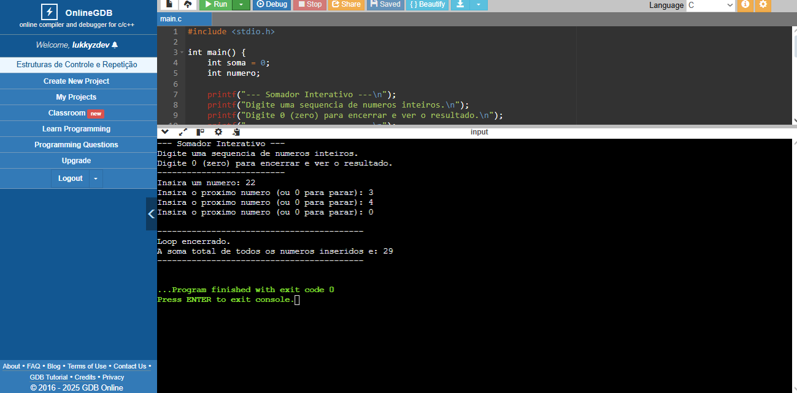

# Estrutura de Repetição “While” Para Executar Uma Tarefa Até Que Uma Condição de Parada Seja Satisfeita 

## *Atividade Proposta* 📝

*Nesta atividade, deverá ser desenvolvido um
programa em C que utiliza a estrutura de repetição “while” para
executar uma tarefa até que uma condição de parada seja
satisfeita. A atividade foca em como controlar loops baseados em
condições de início, garantindo a compreensão de como inicializar,
executar e encerrar laços de repetição corretamente.*

## *Enunciado* 📚

*Crie um programa em C que leia números inteiros do
usuário e calcule a soma de todos os números inseridos. O loop
deve continuar até que o usuário insira o número zero, que será o
valor sentinela para encerrar o programa.*

## *Cenário* 🎬

*Imagine que você está desenvolvendo uma ferramenta
simples de cálculo, onde o usuário deseja somar uma série de
números inteiros até decidir que não deseja inserir mais nenhum
número. A cada inserção, o programa deve somar os números já
inseridos e permitir que o usuário continue até digitar o número 0
(zero), que encerra o programa e exibe o resultado final da soma.*

---
## Execução do Código

## Explicação

***Pense neste algoritmo como uma caixa registradora simples que você usa
para somar compras, e o número zero (0) é o seu botão de "Fechar Conta e
Totalizar".***

--

*Ele pega duas caixinhas na memória:*

*- Uma chamada **Soma**, que começa zerada (soma = 0). Esta caixinha vai
guardar o total acumulado.*
*- Outra chamada **Número**, que vai receber o que você digitar a cada vez.*
  
*O programa te pergunta o primeiro número. Em seguida, ele entra em um
ciclo de repetição (while) que só tem uma regra:*

--

***- Enquanto o número que você digitou não for zero, o ciclo continua.
Dentro desse ciclo, ele faz duas coisas, repetidamente:***

***1- Soma:*** *Pega o número que você acabou de digitar e adiciona ele à
caixinha "Soma". O total acumulado cresce.*

***2- Pergunta de Novo:*** *Pede para você digitar o próximo número.*

--

*Se você digitar qualquer número que não seja zero (como 5, 10, -2), ele
volta para o início do ciclo, soma o número e pergunta de novo.*

*Quando você finalmente digita 0. Nesse momento, a regra do ciclo (numero
!= 0) se torna falsa, e o programa quebra o ciclo.*

***Resumindo:*** *ele é um loop que acumula valores até que você forneça o
sinal de parada (o zero / 0).*
